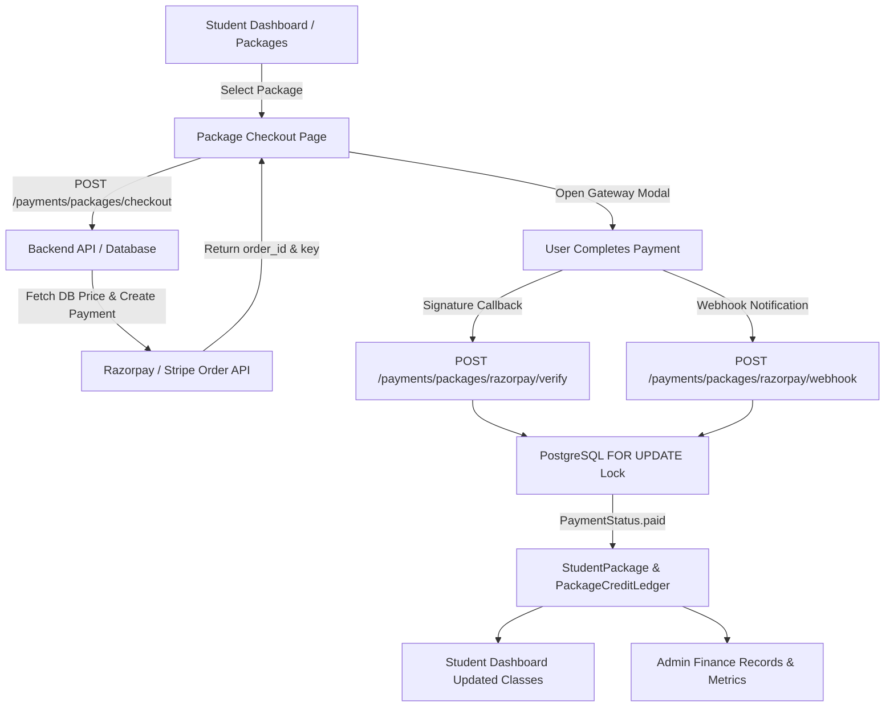

# Dexmy Payment Architecture & Student Package Purchase System (Task 4)

This document provides complete technical documentation for the audited, hardened, and verified payment architecture connecting the student package purchase flow with Razorpay, Stripe, backend idempotency, and admin finance.

---

## 1. Overview & Architecture Diagram

The payment architecture ensures that all financial and package entitlement transactions are server-side authoritative, idempotent, and resilient against client tampering, duplicate webhooks, network latency, and concurrent requests.



---

## 2. Payment Lifecycles & Flows

### A. Initiation (`POST /api/v1/payments/packages/checkout`)
1. Student or Parent requests checkout with `package_plan_id`, `provider` (`razorpay` or `stripe`), and an `idempotency_key` (UUID).
2. **Server-Side Price Authority**: The server reads `package_plans.price` directly from the database. The client cannot pass or alter the payable amount.
3. **Idempotency Check**: If the `idempotency_key` was already used:
   - Returns the existing `Payment` record if payload matches.
   - Raises `409 Conflict` if metadata or plan differs.
   - Raises `409 Conflict` if the payment is already paid.
4. Generates an external provider order via Razorpay API (`create_order`) or Stripe API (`PaymentIntent`).
5. Persists `Payment` record in `created` status with `amount`, `currency`, and `provider_order_id`.

### B. Verification Flow (`POST /api/v1/payments/packages/razorpay/verify`)
1. Receives `payment_id`, `razorpay_order_id`, `razorpay_payment_id`, and `razorpay_signature`.
2. Validates ownership: only the paying user or linked student/parent can verify.
3. If already marked `paid`, immediately returns `{"status": "already_confirmed"}`.
4. Cryptographically verifies HMAC SHA-256 signature using `RAZORPAY_KEY_SECRET`.
5. Verifies server-side with Razorpay API (`fetch_order`) that the order amount and currency match expected values.
6. Calls `activate_package_from_payment`.

### C. Webhook Flow (`POST /api/v1/payments/packages/razorpay/webhook`)
1. Validates Razorpay webhook signature header (`X-Razorpay-Signature`).
2. Supported events:
   - `payment.captured` / `order.paid`: Verifies order amount and currency against database, locks payment row, and activates the package.
   - `payment.failed`: Safely marks payment status as `failed`.
3. If the payment is already `paid`, returns `{"received": True}` immediately.

---

## 3. Database Relationships & Schema Changes

### Database Relationships
- `users`: Represents students, parents, teachers, and admins.
- `package_plans`: Stores active tutoring packages (`class_count`, `price`, `currency`, `is_active`).
- `payments`: Records every payment intent and transaction lifecycle (`amount`, `currency`, `status`, `provider`, `provider_order_id`, `provider_payment_id`, `idempotency_key`, `student_id`, `payer_id`, `package_plan_id`, `package_id`).
- `student_packages`: Entity representing active purchased packages credited to a student (`total_classes`, `classes_used`, `status`, `payment_id`).
- `package_credit_ledgers`: Detailed audit log of every credit additions/deductions (`delta`, `reason`, `booking_id`, `created_at`).

### Migration `004_student_package_payment_unique.sql`
```sql
-- Enforces that a single payment cannot be associated with more than one student_package
ALTER TABLE student_packages ADD CONSTRAINT uq_student_package_payment_id UNIQUE (payment_id);
```

---

## 4. Idempotency, Concurrency & Transaction Safety

To guarantee **exactly-once activation**:
1. **Row-Level Locking**: `activate_package_from_payment` locks the `Payment` row using PostgreSQL `with_for_update()`. If a webhook and a frontend verification request arrive at the same millisecond, one waits for the other.
2. **Status Short-Circuit**: The second request inspects `payment.status == PaymentStatus.paid`, finds `payment.package_id`, and returns the existing package without re-crediting classes.
3. **Database Unique Constraint**: `student_packages.payment_id` has a `UNIQUE` constraint. Even under concurrent anomalies, PostgreSQL prevents duplicate rows.
4. **Savepoint Handling**: Uses `with db.begin_nested():` during flush so that any constraint collision cleanly handles the duplicate and attaches the existing package without aborting the outer database transaction.

---

## 5. API Documentation

### 1. Package Checkout
- **Endpoint**: `POST /api/v1/payments/packages/checkout`
- **Auth**: Bearer Token (Student or Parent)
- **Request Body**:
  ```json
  {
    "package_plan_id": "90e66b8d-...",
    "provider": "razorpay",
    "idempotency_key": "3fa85f64-...",
    "student_id": "optional-for-parent"
  }
  ```
- **Response** (`201 Created`):
  ```json
  {
    "payment_id": "uuid",
    "package_plan_id": "uuid",
    "provider": "razorpay",
    "amount": "15000.00",
    "currency": "INR",
    "razorpay_order_id": "order_xxx",
    "razorpay_key_id": "rzp_test_xxx",
    "razorpay_amount": 1500000
  }
  ```

### 2. Razorpay Verification
- **Endpoint**: `POST /api/v1/payments/packages/razorpay/verify`
- **Auth**: Bearer Token (Student or Parent)
- **Request Body**:
  ```json
  {
    "payment_id": "uuid",
    "razorpay_order_id": "order_xxx",
    "razorpay_payment_id": "pay_xxx",
    "razorpay_signature": "hmac_signature"
  }
  ```
- **Response** (`200 OK`):
  ```json
  { "status": "confirmed" } // or {"status": "already_confirmed"}
  ```

### 3. Student Payment History
- **Endpoint**: `GET /api/v1/payments/packages/history`
- **Auth**: Bearer Token (Student or Parent)
- **Response** (`200 OK`):
  ```json
  [
    {
      "id": "uuid",
      "package_name": "50 Classes Package",
      "amount": 15000.0,
      "currency": "INR",
      "provider": "razorpay",
      "provider_payment_id": "pay_xxx",
      "status": "paid",
      "created_at": "2026-09-20T10:00:00Z"
    }
  ]
  ```

### 4. Admin Finance Payments List
- **Endpoint**: `GET /api/v1/admin/finance/payments?page=1&page_size=50`
- **Auth**: Bearer Token (Admin / Finance Manager with `payment.read` permission)
- **Response** (`200 OK`):
  ```json
  {
    "items": [
      {
        "id": "uuid",
        "student_id": "uuid",
        "student_name": "Student Name",
        "package_name": "50 Classes Package",
        "amount": 15000.0,
        "currency": "INR",
        "provider": "razorpay",
        "status": "paid",
        "created_at": "2026-09-20T10:00:00Z"
      }
    ],
    "total": 1,
    "page": 1,
    "page_size": 50
  }
  ```

---

## 6. Frontend Integration & Experience

1. **Checkout (`/checkout/package?package=:id&currency=:currency`)**:
   - Fetches active package plan details.
   - Price calculation displays pure package price from backend (`Number(pkg.price)`).
   - Dynamically loads Razorpay checkout script.
   - Seamlessly handles `loading`, `initiated`, `failed`, `success`, and `409 already processed`.
   - On success, renders clear confirmation showing classes credited and direct navigation to Dashboard.
2. **Student Dashboard (`/dashboard/student`)**:
   - Preserves subject-wise balance rules for configured student accounts (`ayansh.abhilash@gmail.com`, `wargod3508@gmail.com`, `sskUsagm@gmail.com`).
   - For all normal students, displays **Total classes**, **Completed classes**, and **Remaining classes** synchronized from package and Meet records.
3. **Student Account (`/dashboard/student/account`)**:
   - "Payment History" tab allows students to inspect their transactions, providers, status badges, amounts, and reference IDs.
4. **Admin Finance Dashboard (`/dashboard/admin/payments`)**:
   - Populated with live payment records fetched from `GET /admin/finance/payments`.

---

## 7. Automated Testing & Verification

- **Concurrency & Race Condition Suite**: `backend/tests/test_package_payment_concurrency.py`
  - Spawns multi-threaded worker simulations executing concurrent verification and webhook requests targeting the same `payment_id`.
  - Verifies that exactly one `StudentPackage` and one `PackageCreditLedger` entry are committed.
  - Confirms subsequent threads safely receive the existing package or raise `409 Conflict`.
- **Security & Tampering Guards**:
  - Manipulated amounts or currencies trigger `400 Bad Request`.
  - Replayed or forged webhooks trigger `400 Bad Request` on signature validation.
  - Cross-student access attempts trigger `403 Forbidden` / `404 Not Found`.

---

## 8. Deployment Instructions

1. **Environment Variables**:
   ```env
   RAZORPAY_KEY_ID=rzp_test_...
   RAZORPAY_KEY_SECRET=...
   RAZORPAY_WEBHOOK_SECRET=...
   STRIPE_SECRET_KEY=sk_test_...
   STRIPE_PUBLISHABLE_KEY=pk_test_...
   STRIPE_WEBHOOK_SECRET=whsec_...
   ```
2. **Database Migration**:
   Run the migration script against PostgreSQL:
   ```bash
   psql -U postgres -d dexmy -f backend/sql_migrations/004_student_package_payment_unique.sql
   ```
3. **Webhook Webhook URL Configuration**:
   - In the Razorpay Dashboard, set webhook URL to:
     `https://<domain>/api/v1/payments/packages/razorpay/webhook`
     Subscribed events: `order.paid`, `payment.captured`, `payment.failed`.
   - In Stripe Dashboard, set webhook URL to:
     `https://<domain>/api/v1/payments/packages/stripe/webhook`
     Subscribed events: `payment_intent.succeeded`, `payment_intent.payment_failed`.
